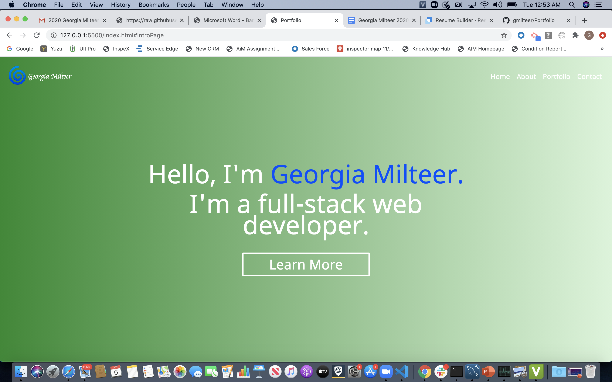

# Portfolio-Website

Portfolio-Website is an application that showcases my recent work, supplies users with information about me and provides ways in which users can get in touch.

## Description

Upon entering the applciation, users are greeted with a minimalist home page featuring a variety of buttons users can click to navigate throughout the page. This application features three main sections: About, Portfolio and Contact.

### About Section

Provides users with information about my background as well as the approach I take to software development.

### Portfolio Section

A showcase of my most recent projects and users can click on the photos, where users can view the deployed applications.

### Contact Section

An all-in-one contact section located in the footer my portfolio page. It features links to my LinkedIn, gitHub, Email and resume.

## Visuals

## Link to Deployed Application

## Future Developments

    1. Rework and refine styling
    2. Add more dynamic features
    3. Include more content throughout
    4. Refine the mobile responsiveness

## Support

For questions, comments or concerns regarding Dev-Portfolio, please email me at gmilteer@gmail.com

## Contributing

Georgia Milteer
